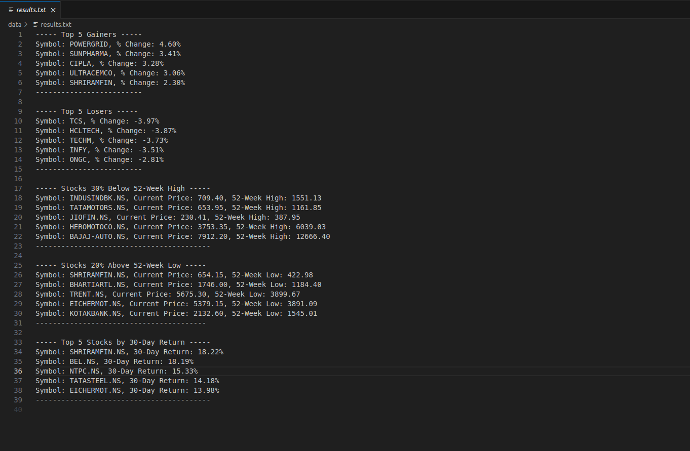
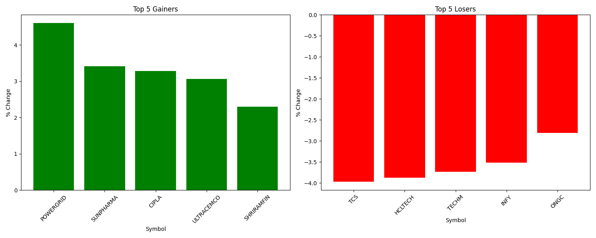
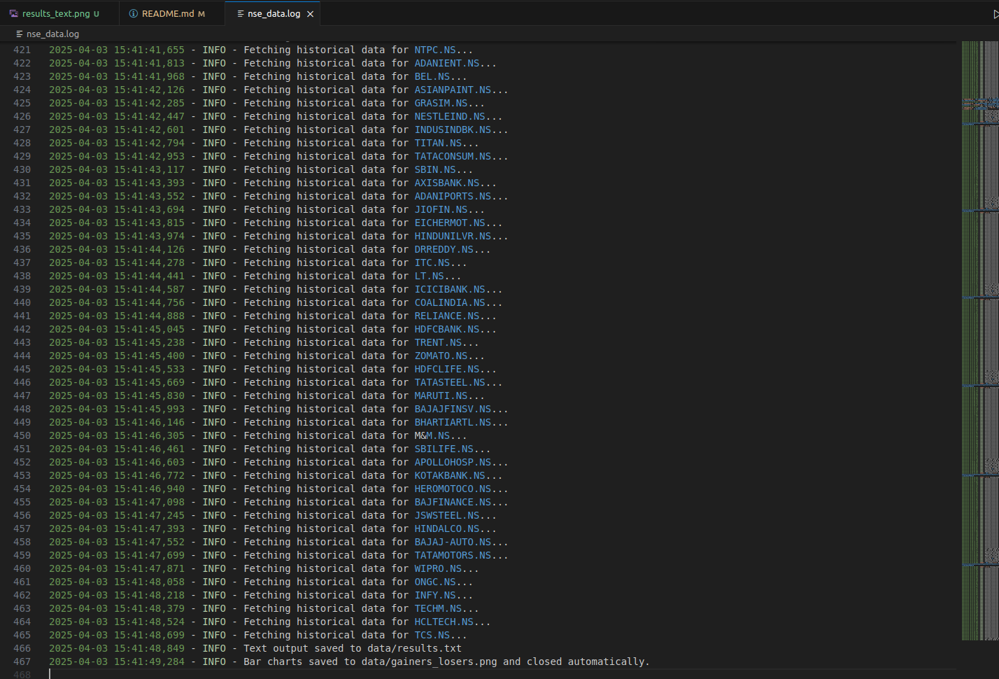

# NSE Data Analysis Project

## Project Overview
This project fetches live NIFTY 50 stock data from NSE India, analyzes historical stock data from Yahoo Finance, and identifies market trends such as top gainers, losers, 52-week high/low comparisons, and 30-day returns. The results are saved in structured text files and visualized as bar charts.

## Objectives
- Fetch live NIFTY 50 stock data from NSE India.
- Extract and analyze historical stock data using Yahoo Finance.
- Identify:
  - Top 5 gainers and losers based on daily percentage change.
  - Stocks trading significantly below their 52-week high.
  - Stocks trading significantly above their 52-week low.
  - Stocks with the highest 30-day returns.
- Save all insights in a structured text file.
- Generate and save visualizations as bar charts.
- Ensure logging is stored in a dedicated log file without cluttering terminal output.


## Technologies Used
- **Python**: Core programming language for data fetching and analysis.
- **Requests**: To fetch live stock data from NSE.
- **Pandas**: For data processing and analysis.
- **yFinance**: For fetching historical stock data.
- **Matplotlib**: For generating bar charts.
- **Logging**: To maintain logs in a separate log file.
- **File Handling**: To store results in structured text and image formats.


## Instructions to Run the Code
1. Ensure you have Python installed (preferably Python 3.8 or later).
2. Install the required dependencies using:
   ```bash
   pip install -r requirements.txt
   ```
3. Run the script using:
   ```bash
   python main.py
   ```
4. The terminal will display relevant outputs while logs and results will be saved in the `data` folder.


## Relevant Links
- **GitHub Repository**: [Insert GitHub link here]
- **ChatGPT Prompts Used**: [Insert ChatGPT chat link here]


- **Generated Reports and Plots**:
  - `data/results.txt` (Contains analyzed stock insights)
  
  - `data/gainers_losers.png` (Visualization of top gainers and losers)
  
  - `nse_data.log` (Logs of all operations performed)
  

## Additional Enhancements Made
- The script ensures structured logging without affecting terminal readability.
- Data and visualizations are stored systematically in the `data/` directory.
- A structured results text file ensures clarity and ease of reference.


